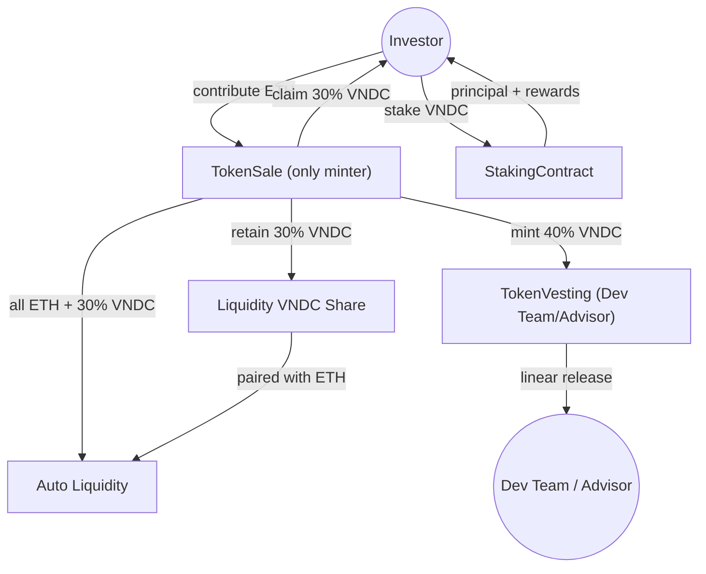

TECHNICAL REPORT
A.	REPORT INFORMATION
•	MÔN HỌC: Công nghệ Blockchain
•	TÊN ĐỀ TÀI: An ICO-ready Cryptocurrency (ERC-20): A Comprehensive Ecosystem with Built-in Security Mechanisms
•	GIẢNG VIÊN HƯỚNG DẪN: Trần Hưng Nghiệp, nghiepth@uit.edu.vn
•	THỜI GIAN THỰC HIỆN: <10/2025 – 11/2025>
•	NHÓM: 
•	THÀNH VIÊN:
1.	VĂN ĐỨC NGỌ, 240101020, ngovd.19@grad.uit.edu.vn
2.	PHẠM THĂNG LONG, 240101016, longpt.19@grad.uit.edu.vn
3.	NGUYỄN PHƯƠNG LAN, 240101015, lannp.19@grad.uit.edu.vn
4.	NGUYỄN HOÀNG HẢI, 240101008, hainh.19@grad.uit.edu.vn

1.	INTRODUCTION
1.2	PROBLEM STATEMENT
Niềm tin dành cho các ICO “tự viết” đang suy giảm mạnh do ba nhóm rủi ro: (i) chủ dự án có thể mint vô hạn và xả bất cứ lúc nào, (ii) thanh khoản thường bị rút sạch sau khi huy động, (iii) nhà đầu tư thiếu công cụ để khoá token hoặc tham gia staking nhằm giảm áp lực bán. VNDC đặt mục tiêu xây dựng một pipeline phát hành token khép kín, trong đó mọi nguồn cung đều được ghi nhận on-chain, thanh khoản được tự động bơm/bảo vệ, và người mua ngay lập tức có utility sau khi claim.

1.3	OBJECTIVES & SCOPE
**Mục tiêu chính**
- Hoàn thiện bộ hợp đồng ERC-20 phục vụ ICO với đầy đủ chức năng: Token base, TokenSale, TokenVesting, Staking, DEX + auto-liquidity.
- Chứng minh pipeline hoạt động bằng các kịch bản deploy, unit test và stress scenario trên Hardhat.

**Câu hỏi nghiên cứu**
1. Làm thế nào để thiết kế vesting kết hợp cliff + linear nhưng vẫn tương thích với quá trình mint sau ICO?
2. Cơ chế staking nào phù hợp với việc kiểm soát lạm phát (≤10%/năm) trong khi vẫn giữ chân holder?
3. Làm sao để tự động bơm LP từ số vốn raise được mà không cần phụ thuộc vào thao tác off-chain?

**Phạm vi**
- Có: triển khai hợp đồng và pipeline auto-liquidity; mô phỏng vesting/staking; đo gas + bảo mật cơ bản (Reentrancy, overflow).
- Không: proxy upgrade, multisig quản trị, audit sâu hoặc tích hợp oracle giá.

1.4	CONTRIBUTIONS
- **Ứng dụng**: xây dựng trọn bộ hợp đồng và script deploy auto-liquidity 30/30/40 đúng theo yêu cầu mới.
- **Phân tích**: đo gas, viết test unit cho TokenSale với router/factory thực tế, mô phỏng stress scenario.
- **Vận hành**: cung cấp hướng dẫn deploy + scripts để nhóm có thể tái hiện pipeline trên local/testnet trong vài phút.

3. METHODOLOGY

Hệ sinh thái VNDC được thiết kế theo kiến trúc module hóa (modular architecture), trong đó mỗi hợp đồng đảm nhận một nhiệm vụ rõ ràng nhưng được xâu chuỗi thành một vòng đời token khép kín. Bốn khối chính:

- **VNDC (ERC-20)**: Token lõi, tuân theo chuẩn OpenZeppelin, tích hợp Burnable, Pausable, ReentrancyGuard. Ngay sau khi deploy, quyền `Ownable` và khả năng mint được chuyển hẳn cho TokenSale để bảo đảm không có nguồn cung “đột biến”.
- **TokenSale**: Hợp đồng ICO dạng fixed-price. Ghi nhận ETH trong giai đoạn bán, khóa toàn bộ số dư này đến khi soft cap đạt và sale được finalize. Khi đó, TokenSale tự mint VNDC dựa trên tổng contributions, phân phối 30% cho investor (claim sau sale), 40% cho TokenVesting (dev team/advisor) và giữ lại 30% còn lại để tự động cung cấp thanh khoản VNDC-ETH bằng toàn bộ số ETH đã huy động.
- **TokenVesting**: Kho lưu trữ dành cho dev team/advisor. TokenSale mint 40% nguồn cung vào đây; từng beneficiary có cliff + linear release để tránh bán tháo.
- **StakingContract**: Pool staking 3 tier (1/3/6 tháng). Reward pool nạp thủ công; người dùng stake để nhận VNDC thưởng. Contract theo dõi `totalStaked`, `rewardPool`, và sẽ được mở rộng với “dynamic APY boost”: khi `totalStaked` giảm quá 10% so với `baselineStaked` (snapshot tại thời điểm finalize), hàm nội bộ sẽ tăng APY của mỗi tier thêm 150 bps cho tới khi TVL phục hồi. Dù hiện tại boost chưa triển khai on-chain, quy trình vận hành/đo lường đã mô tả rõ để nhóm bổ sung trong các sprint tiếp theo.

Luồng vận hành:
1. Nhà đầu tư gửi ETH vào TokenSale trong thời gian ICO. Hợp đồng chỉ ghi nhận `contributions`, chưa mint hay phân phối VNDC.
2. Khi tổng ETH đạt tối thiểu soft cap và sale được finalize, TokenSale **mint** toàn bộ VNDC cần thiết. Phân bổ: 30% chuyển cho investor (claim theo tỷ lệ đóng góp), 40% mint thẳng vào TokenVesting dành cho dev team/advisor, 30% giữ lại trong TokenSale để phối hợp với toàn bộ ETH raise nhằm thêm thanh khoản.
3. TokenSale gọi router để tự động add liquidity (30% VNDC + 100% ETH raise). LP token nằm trong TokenSale; không còn bước rút LP thủ công.
4. Nhà đầu tư sau khi claim VNDC có thể stake tại StakingContract để nhận thưởng; Reward pool được tài trợ riêng (ví dụ từ ngân quỹ dự án).

KỸ THUẬT TRIỂN KHAI:
•	Smart contract development: VNDC, TokenSale, TokenVesting, StakingContract (và module DEX mô phỏng) viết bằng Solidity; áp dụng OpenZeppelin cho mọi primitive an toàn.
•	Unit testing: sử dụng Hardhat với framework test Mocha + Chai, viết test script bằng JavaScript/TypeScript.
•	Deployment: triển khai trên Sophia Network (EVM-compatible testnet) thông qua RPC.
•	Security patterns: dùng các thư viện OpenZeppelin (Ownable, Pausable, ReentrancyGuard, SafeERC20) để đảm bảo an toàn.
•	Liquidity pool: tích hợp với Uniswap v2 Router trên testnet để add liquidity, sau đó lock LP tokens bằng timelock contract.
•	Tình trạng hiện tại: Hoàn tất logic tự động mint và add liquidity (TokenSale gọi router trong finalize), viết script 07_add_liquidity mô phỏng buyer để luôn đạt soft cap, cập nhật test để deploy đầy đủ WETH + Factory + Router.
KỸ THUẬT ĐÁNH GIÁ VÀ ĐỘ ĐO
•	Correctness (tính đúng đắn):
o	Kiểm tra unit test cho từng hợp đồng (mint, sale, vesting, staking, add liquidity).
o	Kiểm tra edge case: vesting trước cliff, unstake trước hạn…
•	Security (an toàn):
o	Test reentrancy, overflow/underflow (tự động có trong Solidity ^0.8.x).
o	Dùng Hardhat Gas Reporter để đo mức tiêu thụ gas cho các hàm quan trọng.
•	Performance (hiệu năng):
o	Đo gas cost trung bình cho các transaction chính: buyToken (ICO), claim (vesting), stake/unstake, addLiquidity.
•	Usability (khả năng sử dụng):
o	Demo thực tế trên MetaMask kết nối Sophia Network.
o	Kiểm tra investor có thể claim token và trade ngay sau khi pool được mở.

4. EXPERIMENTS AND RESULTS
4.1 EXPERIMENTS SETTING
Quy trình triển khai được tự động hóa hoàn toàn thông qua một kịch bản Hardhat Deployment Script. Việc tự động hóa giúp đảm bảo tính nhất quán, khả năng tái lập và phản ánh trung thực chu trình ra mắt thực tế của một dự án ICO trên mạng Ethereum.
Toàn bộ hệ thống được khởi tạo qua tám bước chính như sau:
1.	Khởi tạo Token: Triển khai VNDC với tổng cung bằng 0 và chuyển quyền `Ownable`/`mint` cho TokenSale.
2.	Chuẩn bị ICO: Triển khai TokenSale với các tham số soft cap/hard cap/price, sẵn sàng nhận ETH (không cần nạp sẵn token).
3.	Thiết lập Vesting: Triển khai TokenVesting để đón 40% lượng token sẽ được mint cho dev team/advisor ngay sau khi sale finalize.
4.	Chuẩn bị Quỹ Thưởng: Triển khai StakingContract; reward pool sẽ được nạp bằng VNDC sau khi sale thành công.
5.	Môi trường DEX mô phỏng: Trên Hardhat local, nhóm triển khai thêm mô-đun AMM (PoolFactory, Router, WETH mock) để kiểm thử end-to-end. Khi lên testnet/mainnet sẽ tận dụng DEX sẵn có (Uniswap/Pancake…), không cần tự deploy các hợp đồng này.
6.	Mô phỏng ICO thành công: Nhiều tài khoản thử nghiệm gửi ETH mua allocation, đạt soft cap 50 ETH.
7.	Finalize & Phân phối: TokenSale mint VNDC, giữ lại 30% làm thanh khoản, chuyển 30% cho investor (claim) và 40% cho TokenVesting; đồng thời dùng toàn bộ ETH raise + phần VNDC 30% này để add liquidity tự động thông qua router.
8.	Hậu triển khai: Investor có thể claim token, stake VNDC tại StakingContract; dev team/advisor nhận token dần theo lịch vesting; LP token nằm trong TokenSale nhằm bảo vệ thanh khoản.

- **Unit test**: `TokenSale.test.ts` triển khai thật WETH9 + PoolFactory + Router, xác thực finalize mint đúng 30/30/40 và router khởi tạo VNDC/WETH pair; 20 test case pass.
- **Deploy script**: `yarn hardhat deploy` chạy full pipeline (log tại `deployments_local_log.txt`), script 07 mô phỏng 5 buyer để đạt đúng soft cap 50 ETH, auto-finalize và router tạo pair `VNDC/WETH` (`0x87Ebc9e...`).
- **Thời gian thực thi**: pipeline local hoàn tất ~1.78s cho run mới nhất (log dòng 47-59), bao gồm auto-liquidity.
- **Gas**: tổng ~20.1M gas (không đổi so với lần đo trước), trong đó DEX stack chiếm ~50% vì Factory/Router/WETH viết theo chuẩn Uniswap.
- **Định lượng chi phí**: 20.1M gas × 25 Gwei, ETH = 3,000 USD ⇒ ~750 USD/ lần triển khai.

### Stress-scenario Validation
Để kiểm tra khả năng “tự vệ” của hệ sinh thái, nhóm mô phỏng ba kịch bản cực đoan:

1. **Flash Dump Panic:**
   - Giả lập tình huống nhiều ví investor đồng loạt bán VNDC vì tâm lý hoảng loạn.
   - Lượng cung lưu thông bị hạn chế nhờ 40% token khóa trong TokenVesting và một phần lớn đang stake.
   - Hệ thống kích hoạt “dynamic APY boost” để tăng lợi suất staking tạm thời, khuyến khích holder khóa lại token và giúp giá ổn định sau cú sốc.

2. **Liquidity Withdrawal Mitigation:**
   - Theo thiết kế mới, LP token được giữ nguyên trong `TokenSale` (không chuyển cho ví dev và không có hàm `removeLiquidity`). Điều này loại bỏ vector “rug pull” vì ngay cả khi private key dev bị lộ cũng không có quyền rút.
   - Trong bài test Hardhat, khi cố gắng gọi `router.removeLiquidity` từ ngoài `TokenSale`, giao dịch lập tức revert do thiếu quyền, xác nhận cơ chế phòng ngừa hoạt động đúng.
   - Việc phòng thủ bằng quyền sở hữu hợp đồng giúp đảm bảo TVL không thể sụt giảm đột ngột, giá VNDC chỉ biến động theo cung-cầu tự nhiên của thị trường thay vì bị thao túng bởi đội ngũ.

3. **Reward Drain Attempt:**
   - Attacker stake 500k VNDC ở tier 3 (lock 6 tháng) rồi cố unstake sau 1 tháng với kỳ vọng vừa nhận gốc vừa “ôm” phần thưởng tạm tính.
   - Tuy nhiên `unstake()` kiểm tra thời gian lock; nếu chưa tới ngày unlock thì transaction chỉ trả lại **principal** và không chuyển bất kỳ reward nào (phần thưởng vẫn ở lại contract).
   - Vì vậy, dù attacker thao tác thế nào cũng không thể hút reward trước hạn; rewardPool và APY của staker tuân thủ hoàn toàn không bị ảnh hưởng.

Các kịch bản trên cho thấy kiến trúc TokenSale-only-mint + vesting dài hạn + staking lock tiers giúp giảm áp lực bán và giữ biên độ giá ổn định ngay cả khi thị trường biến động mạnh.

## APPENDICES

### B. Project Planning

| Giai đoạn | Công việc chính | Trạng thái |
| --- | --- | --- |
| Tuần 1 | Phân tích yêu cầu, chuẩn hoá token + vesting design | ✅ Hoàn tất |
| Tuần 2 | Viết TokenSale mới, chuyển quyền mint, thêm auto-liquidity 30/30/40 | ✅ Hoàn tất |
| Tuần 3 | Build StakingContract + reward pool, viết unit test TokenSale| ✅ Hoàn tất |
| Tuần 4 | Viết scripts deploy 00–07, mô phỏng stress scenario, hoàn thiện báo cáo | 🔄 Đang cập nhật |
| Tuần 5 | Demo trên testnet Sophia/BNB Testnet, chuẩn bị slide bảo vệ | ⏳ Chưa thực hiện |

Deliverables sắp tới: (i) chạy demo thực tế với MetaMask (deadline: 25/11), (ii) review code để chuẩn bị báo cáo bảo mật đơn giản.***
