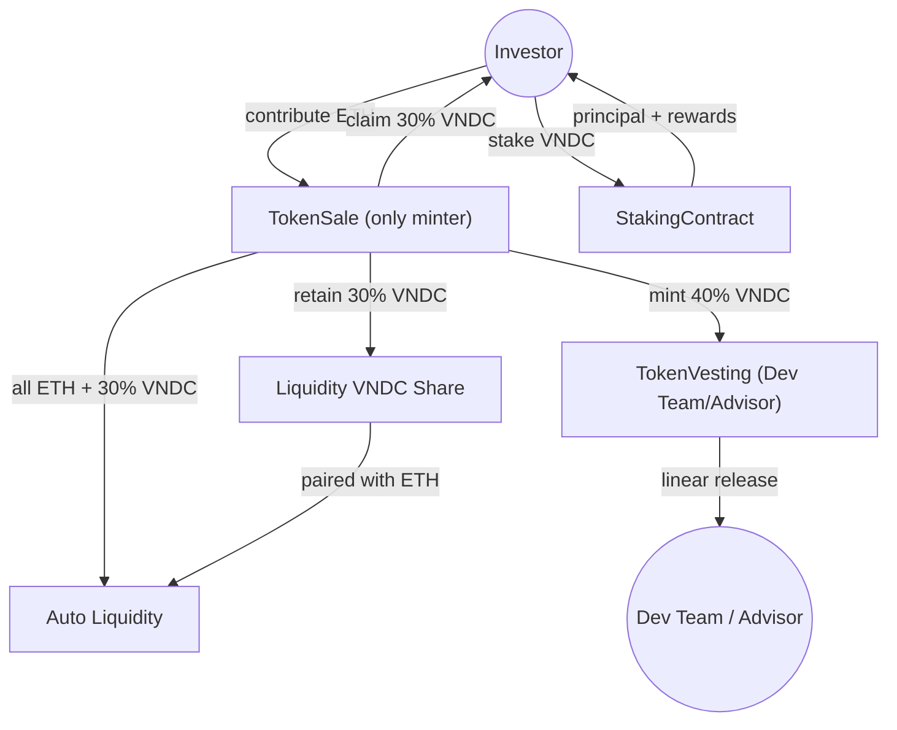

# TECHNICAL REPORT

## A. REPORT INFORMATION
- **Môn học:** Công nghệ Blockchain  
- **Tên đề tài:** An ICO-ready Cryptocurrency (ERC-20): A Comprehensive Ecosystem with Built-in Security Mechanisms  
- **Giảng viên hướng dẫn:** Trần Hưng Nghiệp, nghiepth@uit.edu.vn  
- **Thời gian thực hiện:** 10/2025 – 11/2025  
- **Nhóm:**  
- **Thành viên:**  
  1. Văn Đức Ngọ, 240101020, ngovd.19@grad.uit.edu.vn  
  2. Phạm Thăng Long, 240101016, longpt.19@grad.uit.edu.vn  
  3. Nguyễn Phương Lan, 240101015, lannp.19@grad.uit.edu.vn  
  4. Nguyễn Hoàng Hải, 240101008, hainh.19@grad.uit.edu.vn  

---

# 1. INTRODUCTION

## 1.1 Problem Statement
Niềm tin dành cho các ICO “tự viết” đang suy giảm mạnh do ba nhóm rủi ro:  

1. Chủ dự án có thể mint vô hạn và xả bất cứ lúc nào.  
2. Thanh khoản thường bị rút sạch sau khi huy động.  
3. Nhà đầu tư thiếu công cụ để khoá token hoặc tham gia staking nhằm giảm áp lực bán.  

VNDC đặt mục tiêu xây dựng một pipeline phát hành token khép kín, trong đó mọi nguồn cung đều được ghi nhận on-chain, thanh khoản được tự động bơm/bảo vệ, và người mua ngay lập tức có utility sau khi claim.

## 1.2 Objectives & Scope

### Mục tiêu chính
- Hoàn thiện bộ hợp đồng ERC-20 phục vụ ICO với đầy đủ chức năng: Token base, TokenSale, TokenVesting, Staking, DEX + auto-liquidity.  
- Chứng minh pipeline hoạt động bằng các kịch bản deploy, unit test và stress scenario trên Hardhat.

### Câu hỏi nghiên cứu
1. Làm thế nào để thiết kế vesting kết hợp cliff + linear nhưng vẫn tương thích với quá trình mint sau ICO?  
2. Cơ chế staking nào phù hợp với việc kiểm soát lạm phát (≤10%/năm) trong khi vẫn giữ chân holder?  
3. Làm sao để tự động bơm LP từ số vốn raise được mà không cần phụ thuộc vào thao tác off-chain?

### Phạm vi
- **Có:** triển khai hợp đồng và pipeline auto-liquidity; mô phỏng vesting/staking; đo gas + bảo mật cơ bản (Reentrancy, overflow).  
- **Không:** proxy upgrade, multisig quản trị, audit sâu hoặc tích hợp oracle giá.

## 1.3 Contributions
- **Ứng dụng:** xây dựng trọn bộ hợp đồng và script deploy auto-liquidity 30/30/40 đúng theo yêu cầu mới.  
- **Phân tích:** đo gas, viết test unit cho TokenSale với router/factory thực tế, mô phỏng stress scenario.  
- **Vận hành:** cung cấp hướng dẫn deploy + scripts để nhóm có thể tái hiện pipeline trên local/testnet trong vài phút.

---

# 2. METHODOLOGY

## 2.1 Architecture

Hệ sinh thái VNDC được thiết kế theo kiến trúc **modular architecture**, trong đó mỗi hợp đồng đảm nhận một nhiệm vụ riêng biệt nhưng kết hợp thành một vòng đời token khép kín.

### Các khối chính

- **VNDC (ERC-20):** Token lõi, tuân theo chuẩn OpenZeppelin, tích hợp Burnable, Pausable, ReentrancyGuard. Quyền `Ownable` và `mint` được chuyển cho TokenSale ngay sau deploy.  
- **TokenSale:** Hợp đồng ICO dạng fixed-price, ghi nhận ETH, khóa số dư đến khi soft cap đạt. TokenSale mint VNDC theo tổng contributions: 30% cho investor (claim), 40% cho TokenVesting, 30% giữ lại để auto add liquidity VNDC-ETH.  
- **TokenVesting:** Kho lưu trữ token cho dev team/advisor, tích hợp cliff + linear release.  
- **StakingContract:** Pool staking 3 tier (1/3/6 tháng), reward pool nạp thủ công, theo dõi `totalStaked`, `rewardPool`, hỗ trợ “dynamic APY boost” khi TVL giảm quá 10% so với baseline.

### Luồng vận hành

1. Nhà đầu tư gửi ETH vào TokenSale.  
2. Khi đạt soft cap và sale **finalize**: mint VNDC, phân bổ 30/30/40.  
3. TokenSale **add liquidity** tự động bằng router.  
4. Nhà đầu tư claim VNDC, stake VNDC, dev team nhận token theo vesting schedule, LP token nằm trong TokenSale.  

---

## 2.2 Deployment & Security

- **Smart contract:** Solidity + OpenZeppelin primitives (`Ownable`, `Pausable`, `ReentrancyGuard`, `SafeERC20`).  
- **Unit test:** Hardhat + Mocha/Chai.  
- **Deployment:** Sophia Network (EVM-compatible testnet) thông qua RPC.  
- **Liquidity pool:** Tích hợp Uniswap v2 Router, LP token lock.  
- **Đánh giá:** correctness, security (reentrancy, overflow/underflow), performance (gas cost), usability (MetaMask demo).  

---

# 3. EXPERIMENTS AND RESULTS

## 3.1 Experiment Setting

Pipeline deploy tự động hóa bằng Hardhat Script, gồm 8 bước:

1. Triển khai VNDC, chuyển quyền mint cho TokenSale.  
2. Triển khai TokenSale với soft cap/hard cap/price.  
3. Triển khai TokenVesting cho dev team/advisor.  
4. Triển khai StakingContract, nạp reward pool sau sale.  
5. DEX mô phỏng trên Hardhat local.  
6. Mô phỏng ICO thành công, soft cap 50 ETH.  
7. Finalize & phân phối 30/30/40, add liquidity VNDC-ETH.  
8. Investor claim token, stake, dev team nhận token theo vesting, LP token giữ trong TokenSale.  

### Unit Test & Deploy

- `TokenSale.test.ts`: test finalize mint đúng 30/30/40, router khởi tạo VNDC/WETH pair, 20 test case pass.  
- Deploy script: `yarn hardhat deploy` chạy full pipeline, script 07 mô phỏng 5 buyer đạt soft cap 50 ETH, auto-finalize, pair VNDC/WETH.  
- Thời gian chạy pipeline local: ~1.78s.  
- Gas: ~20.1M, chi phí ~750 USD (25 Gwei, ETH = 3,000 USD).  

## 3.2 Stress-scenario Validation

### 1. Flash Dump Panic
- 40% token khóa TokenVesting, phần lớn stake.  
- Hệ thống tăng APY tạm thời, khuyến khích holder khóa lại token.  

### 2. Liquidity Withdrawal Mitigation
- LP token giữ trong TokenSale, không có quyền rút.  
- Test Hardhat: `router.removeLiquidity` revert, bảo vệ TVL.  

### 3. Reward Drain Attempt
- Attacker unstake trước hạn chỉ nhận **principal**, reward vẫn ở contract.  

**Kết quả:** kiến trúc TokenSale-only-mint + vesting + staking lock tiers giúp giảm áp lực bán, giữ giá ổn định.

---

## 4. APPENDICES

### B. Project Planning

| Giai đoạn | Công việc chính | Trạng thái |
| --- | --- | --- |
| Tuần 1 | Phân tích yêu cầu, chuẩn hoá token + vesting design | Hoàn tất |
| Tuần 2 | Viết TokenSale mới, chuyển quyền mint, thêm auto-liquidity 30/30/40 | Hoàn tất |
| Tuần 3 | Build StakingContract + reward pool, viết unit test TokenSale | Hoàn tất |
| Tuần 4 | Viết scripts deploy 00–07, mô phỏng stress scenario, hoàn thiện báo cáo | Đang cập nhật |
| Tuần 5 | Demo trên testnet Sophia/BNB Testnet, chuẩn bị slide | Chưa thực hiện |
